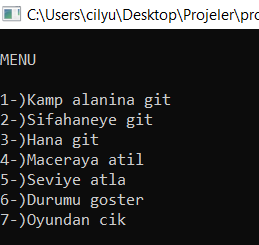
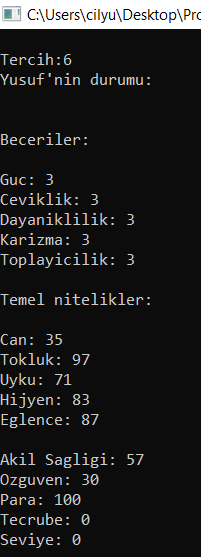

# 🎵Algoritmalar ve Programlama Proje Ödevi
Bu proje, Bursa Teknik Üniversitesi BLM-111 kodlu Algoritmalar ve Programlama dersi kapsamında proje ödevi olarak hazırlanmıştır.

## 🚀Proje Konusu
Oyunun başında kullanıcıdan ozanın adı ve kullandığı çalgının adı alınır.  
Tüm oyun mekanikleri bir sonsuz döngü içerisinde çalışır.  
Kullanıcı çıkış seçeneğini seçene kadar oyun devam eder.  
Senaryo ve maceralar tamamen yaratıcılığa dayalıdır.  

## 📌Çalıştırma
Projeyi klonlayın veya indirin.  
Kodları derleyin (gcc proje.c -o proje gibi).  
Çalıştırın ve ozanın maceralarına eşlik edin. 

## 🚀Proje İçi Görseller
<h3>Menu</h3>
<table>
  <tr>
    <td></td>
  </tr>
</table>

<h3>Durum</h3>
<table>
  <tr>
    <td></td>
  </tr>
</table>

<h3>Kayıt</h3>
<table>
  <tr>
    <td></td>
  </tr>
</table>

<h3>Seviye Atlama</h3>
<table>
  <tr>
    <td></td>
  </tr>
</table>

<h3>Oyunu Kapatma</h3>
<table>
  <tr>
    <td></td>
  </tr>
</table>

## Katkıda Bulunanlar
Bu proje, laboratuvar hocalarının yönlendirmeleri sonucu 2 kişi tarafından geliştirilmiştir.  
👤 Yusuf Çelik  
👤 Abdullah Çelik

